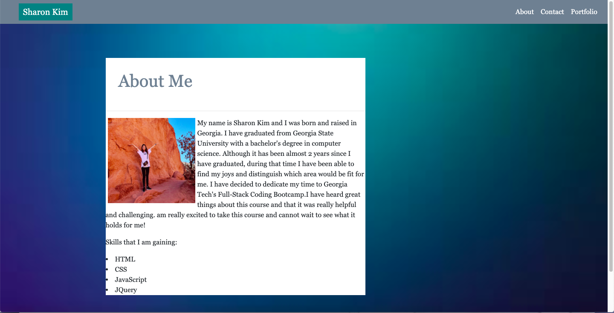
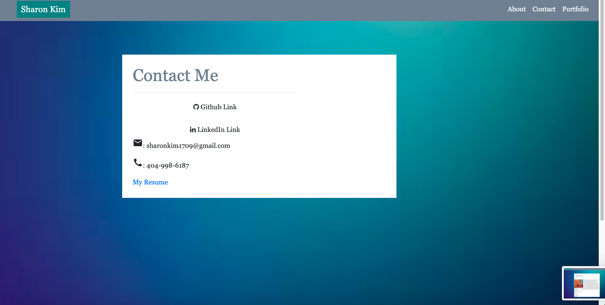
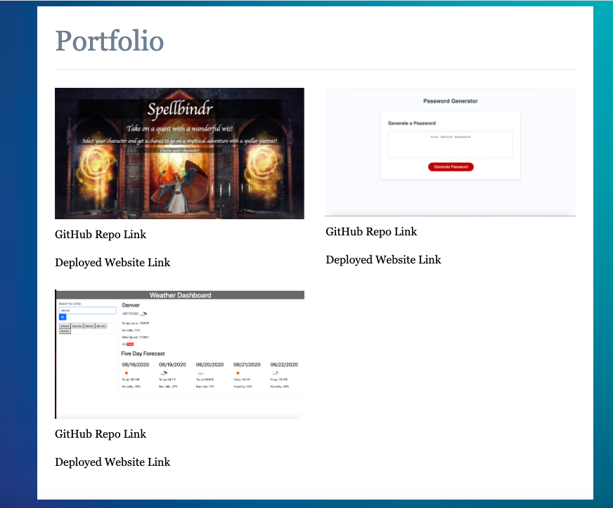

# My Personal Portfolio Site

## Description 

This is my porfolio site designed to meet the criteria for GT Full-stack Flex program homework requirements.

It is built using Bootstrap CSS and customized based on design mockups provided in class.

## Table of Contents

* [Installation](#installation)
* [Usage](#usage)
* [Credits](#credits)
* [License](#license)

## Installation

1. Clone the repo
2. Open index.html in default browser

## Usage 
This is a portfolio website in which everyone can see and access my personal portfolio.
This assignment utilizes Bootstrap CSS Framework(containers, rows, and columns) to create a mobile responsive portfolio. 

[Deployed Portfolio Site](https://sharonkim09.github.io/gt-hw-bootstrap-portfolio/)

## Credits

This site was designed by the curriculum team. The design/mockup was provided to me. 

Credit to the Twitter Bootstrap team for designing an awesome CSS Library.

## License

MIT License

Copyright (c) [2020] [Sharon Kim]

Permission is hereby granted, free of charge, to any person obtaining a copy
of this software and associated documentation files (the "Software"), to deal
in the Software without restriction, including without limitation the rights
to use, copy, modify, merge, publish, distribute, sublicense, and/or sell
copies of the Software, and to permit persons to whom the Software is
furnished to do so, subject to the following conditions:

The above copyright notice and this permission notice shall be included in all
copies or substantial portions of the Software.

THE SOFTWARE IS PROVIDED "AS IS", WITHOUT WARRANTY OF ANY KIND, EXPRESS OR
IMPLIED, INCLUDING BUT NOT LIMITED TO THE WARRANTIES OF MERCHANTABILITY,
FITNESS FOR A PARTICULAR PURPOSE AND NONINFRINGEMENT. IN NO EVENT SHALL THE
AUTHORS OR COPYRIGHT HOLDERS BE LIABLE FOR ANY CLAIM, DAMAGES OR OTHER
LIABILITY, WHETHER IN AN ACTION OF CONTRACT, TORT OR OTHERWISE, ARISING FROM,
OUT OF OR IN CONNECTION WITH THE SOFTWARE OR THE USE OR OTHER DEALINGS IN THE
SOFTWARE.

---

## Contributing

We are not currently accepting contributors at the moment.

